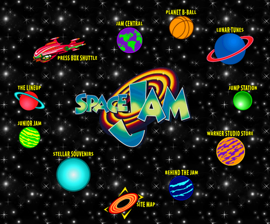

# Discovery
My first interaction with the internet dates back to around 1997, that makes me about 6 years old. At school, out of the few computers we had, one, and only one had access to the knowledge network.

Someone decided that printing an image of a few planets and giving it to me was a cool idea. It was a very dark image, I mean planets should be in the space, and the space is known to be pitch black. I think whoever gave that piece paper to me just didn't want to feel guilty about using so much ~~unicorn blood~~ ink.

Nowadays I believe that image to be from the back then popular, space jam website.

if there was cool cartoons of planets in this thing called internet, what else might be hiding in said space? Even without realising it, __I was hooked__.

Once they explained to me the basics of how the internet worked, my quest then became to find where that planet image came from. If there was a google back then, I didn't know. It would take a while until I'd find out about search engines.
My best strategy became to gather every web url I could find on any magazine, tv or newspaper, and write it down in a piece of paper. I still remember mixing up some email adresses in it. After losing a couple pieces of paper packed with urls, and noticing how unusable it actually was for the use I was intending. I gave up.
Then I did the kid thing for a few years I guess.

Fastforward to when I was about 10, I got my first computer, no internet off course. Back then you would hear only spooky stories about it.

Even without internet, the computer fascinated me, __how does this thing work?__ probably magic. I played a couple of computer games, and then I discovered one of my favourite kinds of software.

# Emulators
A year before Pokemon Gold would be released in europe, someone handed to me an emulator with a half english half japanese ROM of said game. That thing blew my mind, you can have a GameBoy inside your computer? __what else can this thing do?__ again it felt like magic. It was an escape from the money constrained world, and being a kid, that was freedom.

Let's not forget the goal at this time, even though the game was in japanese, by the time there was ads on TV about the new pokemon game, I had already completed it. Also for the first time I experienced the emptiness after focusing on my computer time for a long time.

That enjoyment spiraled into about 2 years of my life playing pokemon gold, and further that, once I found the GameBoy advance emulator, I completed every decent game of that platform.

The procedure was easy, get somewhere where I can connect to the internet, get myself a pack of _Diskettes_, download all the games (roms) I can, and get them home where I could play them peacefully. Now that I think about it It must have been _30Mb_ worth of games every time. 

After that I believe I took another break that would last a few years, I think I was computerless for a while.

# Flash games

Next memory of my computing story comes from back when I was about 14 years old. Following the same procedure, maybe equipped with some __Rewrittable CDs__. I found I could right click on a flash game, mark _save as_ and bring it home with me. Some would work, some might not, but it was another ~~fix~~ source of free games.

That was fun, games were more indie, still not very demanding and it required some trickery, that I enjoyed. The next thing I remember is firing up __Cheat engine__, trying to trick the game into thinking I had 99999 lives or gold, or everything I could. That was a beautiful introduction to how computers work. I still didn't need to know much, but gave some insight to how the beast ticked.

As a consequence to this, and because cheat engine was a tedious process, I did discover programming. Visual Basic 6 to be precise. 

> "It's like Microsoft Word but for making another Microsft Word" - I'd say to my family. 

The first thing I learnt to do was to load a flash game inside a VB application and mess with the variables directly. I think people used to call those __trainers__. I would be able to have a button that would give an extra life, or heal my character, give some more money... It would also allow for new tricks, like changing the _speed_ or some other variable that I would not know about otherwise.

Shortly after that, my first programming idea became to life _a copy the windows calculator itself_, that was cool, I remember making it red and extending it's capabilities to solve "second grade equations", not like a freely one (I didn't do one of that until university), just one that you input a, b, c and does the `(-b +- sqrt(b*b - 4a*c))/(2*a)`

After that little introduction to programming, I think I gave up for a while, at that point I didn't really know how to build anything that would not fit in a single file, and off course I was busy being a teenager.

# Initial studies

Right after high school, I went to technical school, "Informatic and telematic systems", that was a promising title for an underwhelming 2 years of study. There was a couple of subjects that were cool though, a basic programming one, and a linux one. Not like I fell in love with the operating system (yet) or I learnt any fancy programming techinque, it just __got me bored and thirsty again__.

I also have fond memories of what comes around that time, with very little formal algorithms knowledge, during my free time I'd go to [project euler](https://projecteuler.net) and solve random problems. Project euler provides mathematical problems and a way to validatethe output

For example
> What is the 10001st prime number?

That tought me to think like a computer, how to represent a solution to a problem through code. I did that in python.
Then I stumbled into another wall, I noticed that for some problems, running the solution with a small input, the computer would be able to crunch it. But with some bigger inputs, it would just take seemingly forever to calculate. With the previous example, __it's way easier to calculate the 3d prime number than the 10001st__. That is what is known as _algorithmic complexity_ which again would take me until my bachelor to wrap my head around.

That was a cool computer gymnastic but that's this kind of weird art that only a very few people can understand. 

# Android
Soon after that, the iphone came out, and more importantly to me, Android came out. I fell in love with it, I was a proud owner of a __Samsung galaxy S__, without a numeric apendix, the possibilities of that device seemed endless, and the juicy [bounty](https://en.wikipedia.org/wiki/Android_Developer_Challenge) that gogle set, got me interested in android programming.
Being at the right moment at the right place, got me to develop [mac remote](/projects/macremote), one of the highs of my internet experience, with the minimal knwoledge required, __I built something that was used by other people__, just like I had used thousands of computer programs before, now, some people were using one that I made. That felt great.

# Until today
Well yeah, there's a lot more until today, I might write about it that in the future. 

# Conclusion
Wait, what? conclusion? well, you my reader, first of all thanks for reading this. This is for you as it is for me, out of all these ramblings, __this is just a reminder that you are where you have to be.__

