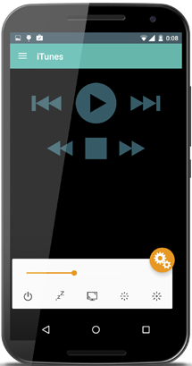

## The pain-point
Apple remotes were getting discontinued after the Macbook Retinas. All the remote controlling apps needed some software running on the computer and I was not comfortable with that.

## What it did
It was an Android app made to control OSX devices from said smartphones. Media controls, volume control, remote shutdown... among those lines.
The neat trick that it had, was that it didn't need any specific software running on the mac itself! It used a combination of SSH access and inlining AppleScript commands. 
But it required ssh credentials, which I would not recommend anyone to share.

## Experience
This was my first experience at self-developing something and releasing it into the wild.

It got [some](https://lifehacker.com/mac-remote-controls-your-mac-from-the-comfort-of-your-a-5991748) [press](https://www.xda-developers.com/use-your-android-as-a-remote-control-on-mac/) attention and got about 200k downloads. After a 3 year run and about 20 updates. Eventually, better solutions appeared and I lost interest.
Maybe I will get back to it one of those days, at least to release the source code or something.