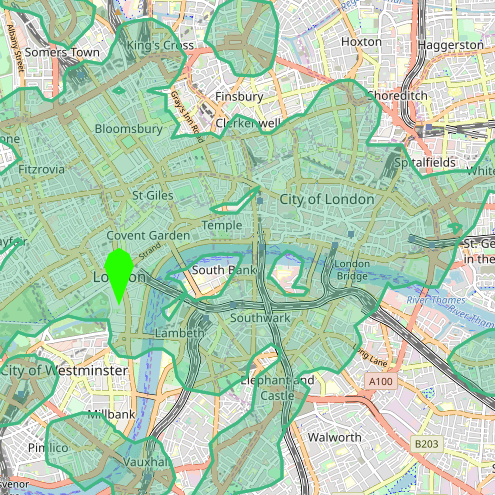

## The pain-point
This is my latest project! I'm trying to look at my nuances when I was looking for a place to live in London.

I noticed a pattern when looking for flats online. I would __Input all the parameters__ that every portal would allow me, budget, area, number of flatmates... __then go to google maps and check commute times__ to a couple of places I'd go frequently. I would make sure were reasonable, and if so I'd move ahead.
It was painful enough for me, so I assume it might be annoying to someone else.

Therefore I'm building a website that allows us to search properties within a commute time from a point. 

## So far I've...
- Chosen technologies, Django + react will be
- Infrastructure based on Docker + Docker-machine
- Created a dev environment that hot reloads most of the code (except dependencies) BE&FE
- Created deployment in [production](http://maps.agustibau.com)
- FE: Basically what you can see in [production](http://maps.agustibau.com)
- BE: I'm able to get Isochronic areas, register users and get listings, I scrap data from multiple sources.
- Added basic analytics with a matomo instance.

## I still have to...
- Make infrastructure scalable using Kubernetes
- Automate scraping ETL with Celery
